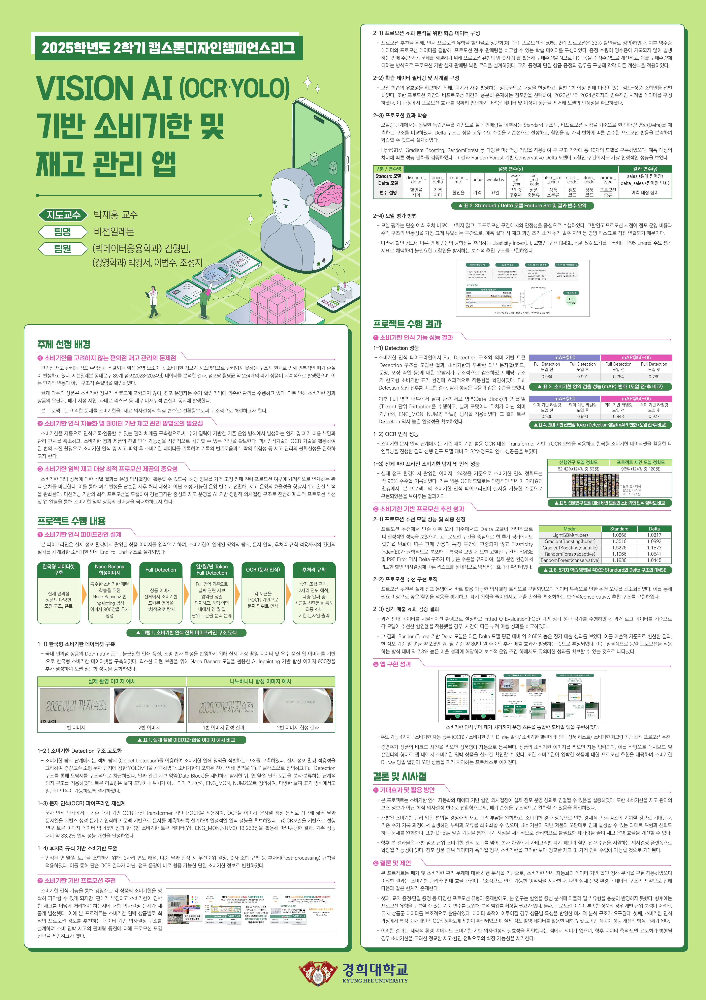

# VISION AI (OCR·YOLO) 기반 소비기한 및 재고 관리 앱

> **2025학년도 2학기 캡스톤디자인 챔피언스리그 — 대상 수상**
> **세븐일레븐 대표 표창 수상**

- **지도교수**: 박재홍 교수 (경희대학교)
- **팀명**: 비전일레븐
- **팀원**: 김형민 (빅데이터응용학과), 박경서 (경영학과), 이범수 (경영학과), 조성지 (경영학과)

---

## 프로젝트 개요

세븐일레븐 동대문구 89개 점포(2023~2024년) 데이터 분석 결과, **점포당 월평균 약 234개의 폐기 상품**이 지속적으로 발생하는 구조적 손실이 확인되었다.
현재 대부분의 편의점 상품은 소비기한 정보가 바코드에 포함되지 않아, 점포 운영자가 수기 확인·기억에 의존한 재고 관리를 수행하고 있으며, 이로 인해 다음과 같은 문제가 발생한다.

- 소비기한 경과 상품의 오판매 및 과태료 리스크
- 폐기 시점 지연으로 인한 재무 손실 누적
- 관리 편차 및 수기 입력 누락

본 프로젝트는 **소비기한을 재고 의사결정의 핵심 변수로 전환**하여 위 문제를 구조적으로 해결하고자 한다.

---

## 프로젝트 판넬



---

## 핵심 기능

| 기능 | 설명 |
|------|------|
| 소비기한 자동 등록 (OCR) | 상품 이미지 촬영 한 번으로 소비기한 자동 인식 및 기록 |
| 소비기한 임박 D-day 알림 | 소비기한 당일 앱 푸시 알림 발송 |
| 소비기한 캘린더 & 임박 상품 리스트 | 대시보드 형태로 소비기한 임박 상품 실시간 확인 |
| 최적 프로모션 추천 | 소비기한·재고량 기반 ML 모델이 최적 할인율 추천 |

---

## 시스템 구성

### 1. 소비기한 인식 파이프라인

```
상품 이미지 입력
    ↓
[Full Detection]  — YOLOv11: 소비기한 포함 전체 인쇄 영역 탐지
    ↓
[Date Block & Token Detection]  — 연·월·일 단위 토큰 분리·분류 (의미 기반 라벨링: Y4, ENG_MON, NUM2)
    ↓
[OCR 문자 인식]  — TrOCR (Transformer 기반) 파인튜닝
    ↓
[후처리 규칙]  — 2자리 연도 해석, 다중 날짜 우선순위 결정, 숫자 조합 규칙
    ↓
최종 소비기한 문자열 출력
```

#### 1-1. 한국형 소비기한 데이터셋 구축

- 실제 매장 촬영 데이터 + 우수 품질 웹 이미지 수집
- Dot-matrix 폰트, 불균일 인쇄 품질, 조명 반사 등 국내 편의점 특성 반영
- **Nano Banana 모델** 기반 AI Inpainting으로 합성 이미지 **900장** 추가 생성 → 모델 일반화 강화

#### 1-2. Detection 구조 고도화

- **YOLOv11** 채택 (경량·고속·소형 문자 탐지 최적화)
- Full Detection → Date Block Detection → Token Detection 단계적 구조
- 의미 기반(Y4, ENG_MON, NUM2) 라벨링으로 다양한 날짜 표기 방식 대응

#### 1-3. OCR 파이프라인 재설계

- 기존 패치 기반 범용 OCR → **TrOCR (Transformer 기반)** 으로 전환
- 선행 연구 토큰 이미지 약 **45만 장** + 한국형 소비기한 토큰 데이터 **13,253장** 파인튜닝
- 기존 대비 **약 83.2% 인식 성능 개선**

#### 1-4. 후처리 규칙

- 2자리 연도 해석, 다중 날짜 우선순위 결정, 숫자 조합 규칙 적용
- 단순 OCR 결과 → 점포 운영에 즉시 활용 가능한 소비기한 정보로 변환

---

### 2. 프로모션 추천 모델

#### 2-1. 학습 데이터 구성

- 프로모션 유형을 할인율로 정량화 (1+1 → 50%, 2+1 → 33%)
- 영수증 + 프로모션 데이터 결합 → 프로모션 전·후 판매량 비교 학습 데이터 구성
- 증정 수량 왜곡 문제 해결: 구매수량 ÷ N + 증정수량으로 실제 판매량 복원

#### 2-2. 모델 구조 비교

| 구조 | 예측 대상 |
|------|-----------|
| Standard 모델 | 절대 판매량 (sales) |
| Delta 모델 | 판매량 변화량 (delta_sales) |

**입력 변수**: 할인율 차이, 가격 차이, 할인율, 가격, 요일, 주차, 상품 중·소분류, 점포 코드, 상품 코드, 프로모션 종류

#### 2-3. 모델 성능 비교 (RMSE)

| 모델 | Standard | Delta |
|------|----------|-------|
| LightGBM (huber) | 1.0866 | 1.0817 |
| GradientBoosting (huber) | 1.3510 | 1.0892 |
| GradientBoosting (quantile) | 1.5226 | 1.1573 |
| RandomForest (adaptive) | 1.1966 | 1.0541 |
| **RandomForest (conservative)** | 1.1830 | **1.0445** ✅ |

→ **RandomForest 기반 Conservative Delta 모델** 최종 선정

#### 2-4. 평가 지표

고프로모션 구간의 안정성 중심 평가:
- **Elasticity Index (EI)**: 할인 강도별 판매 반응 균형성
- **고할인 구간 RMSE**
- **P95 Error**: 상위 5% 오차

#### 2-5. 장기 매출 효과 (FQE 기반 시뮬레이션)

- 다른 Delta 모델 평균 대비 **약 2.65% 높은 장기 매출 성과**
- 환산 시: 점포 기준 일 평균 **약 2.6만 원**, 월 기준 **약 80만 원** 추가 매출
- 일괄 프로모션 적용 대비 **약 7.3% 높은 매출 성과**

---

## 성능 결과 요약

### Detection 성능

| 구분 | mAP@50 (전) | mAP@50 (후) | mAP@50-95 (전) | mAP@50-95 (후) |
|------|------------|------------|---------------|---------------|
| Full Detection 도입 | 0.984 | **0.991** | 0.754 | **0.789** |
| 의미 기반 라벨링 (Token) | 0.906 | **0.993** | 0.848 | **0.927** |

### 전체 파이프라인 인식 정확도

| 모델 | 정확도 |
|------|--------|
| 선행 연구 모델 | 52.42% (124장 중 63장) |
| **본 프로젝트 제안 모델** | **96% (124장 중 120장)** ✅ |

---

## 기대 효과 및 활용 방안

1. **폐기 손실 절감**: 소비기한 임박 상품을 실시간 식별하여 구조적 폐기 손실 완화
2. **과태료 리스크 제거**: 소비기한 경과 상품의 오판매 사전 차단
3. **운영 효율화**: 수기 관리에서 AI 기반 자동화로 관리 부담 대폭 감소
4. **수익 개선**: 데이터 기반 최적 프로모션으로 소비기한 임박 상품 판매 극대화
5. **확장성**: 개별 점포 도구 → 본사 차원 카테고리별 폐기 패턴 분석 플랫폼으로 확장 가능

---

## 한계 및 향후 과제

- 다양한 프로모션 유형(교차 증정 등)의 충분한 반영 필요
- 프로모션 이력 부족 상품에 대한 미시적 분석 구조 고도화
- 특정 숫자 패턴 OCR 정확도 개선을 위한 실제 점포 데이터 기반 재학습 및 도메인 적응

---

*경희대학교 | 2025학년도 2학기 캡스톤디자인 챔피언스리그*
